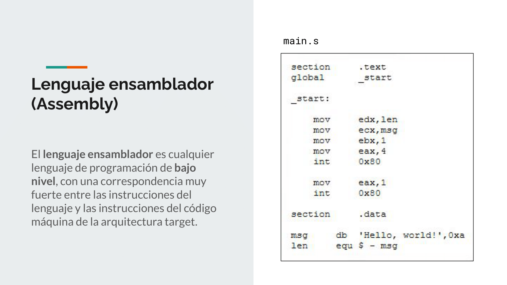
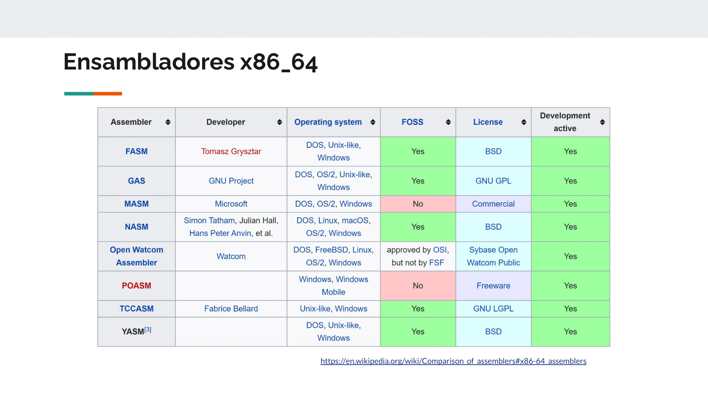
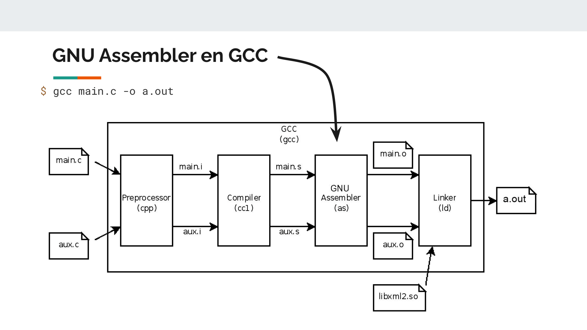
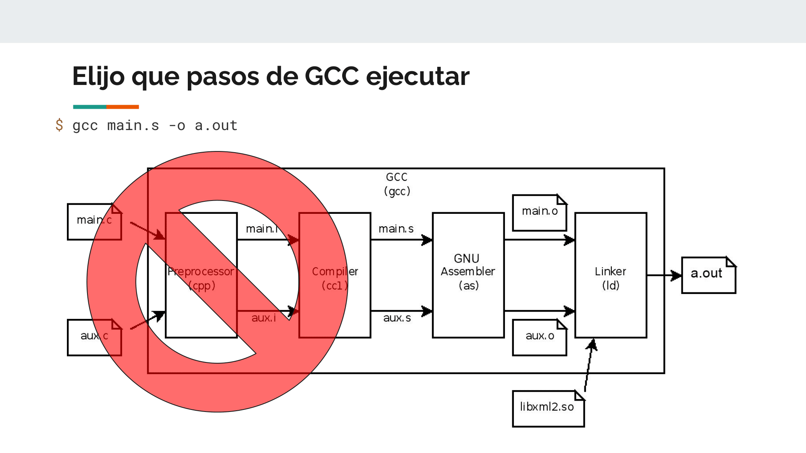
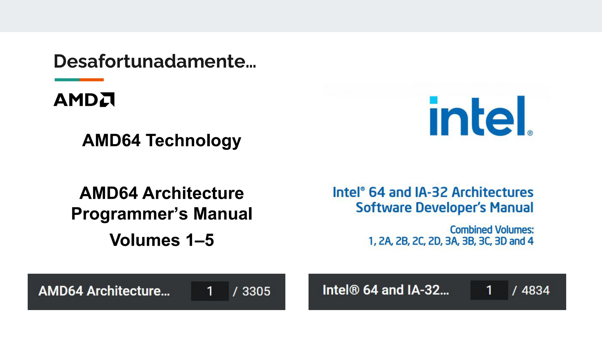
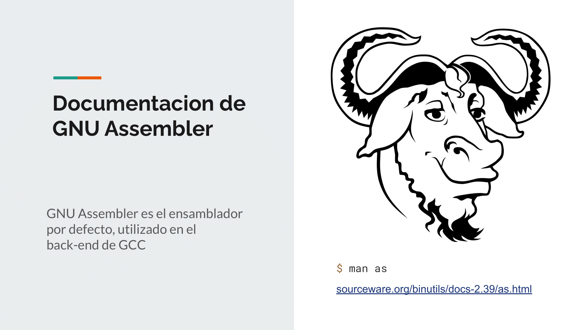
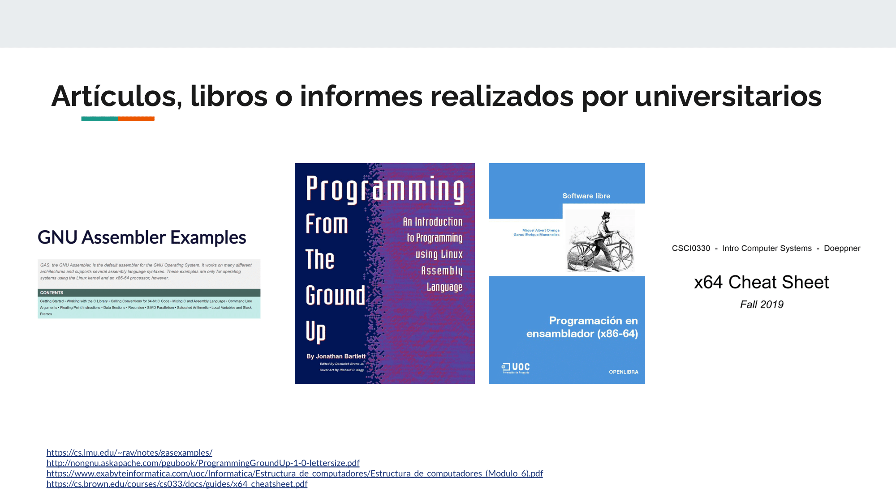
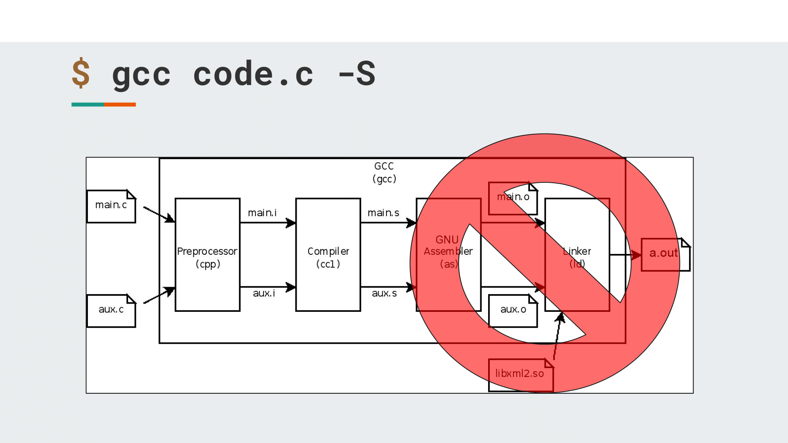

# **Ruta: Tecnologías industriales**   Assembly x86_64

## **Lenguaje Assembly**

Imagino que todos ustedes saben que es assembly, pero igualmente hago un repaso. Básicamente, es un lenguaje en el que se escriben instrucciones directamente para el CPU, pero en vez de con unos y ceros como machine code, se usan nombres para cada instrucción y registro, se usan etiquetas y otras cosas, para que pueda ser leído más fácilmente por personas, como se ve acá en el programa de la derecha

En el caso de mi target, elegí assembly Intel x86_64, que es el tipo de procesadores que usan prácticamente todas las computadoras de escritorio, y la mayoría de servidores (aunque ya no tanto con el desarrollo en RISC-Five, y ARM).

Bueno, una vez que tengo el archivo assembly, ¿cómo hago para ejecutar el programa? 
 

---

## **Como ejecutar un archivo Assembly**

Existen muchos ensambladores distintos, que uno puede encontrar, acá hay una lista de los que aparecen en Wikipedia.

> #### Fuente:
> https://en.wikipedia.org/wiki/Comparison_of_assemblers#x86_assemblers

 

Yo decidí usar GAS, o GNU Assembler, que es el que se encuentra integrado dentro de GCC por defecto para la compilacion de codigo C.

 

Como GCC está compuesto de programas discretos para cada paso, puedo indicarle de que en vez de ejecutar todo el proceso, inicie en el proceso de ensamblado a partir de un archivo .s
Lo que hay que hacer es, en vez de pasarle un archivo .c, le pasas un archivo .s, y GCC arranca desde el paso de ensamblado.

> Recuerden esta característica de los programas discretos de GCC porque me va a ser útil más adelante.

 

---

## **Fuentes de información primaria**

Como fuente de información primaria tengo, primero los 2 manuales de la arquitectura de AMD e Intel, esta es la fuente que va más a fondo en como funciona, y como programar el procesador.

> #### Fuentes:
> https://www.amd.com/content/dam/amd/en/documents/processor-tech-docs/programmer-references/40332.pdf
> https://www.intel.com/content/www/us/en/developer/articles/technical/intel-sdm.html

 

Pero los manuales tienen una *pequeña desventaja*...

 

También puedo usar la documentación del Assembler de GNU. Aunque no hay tanta información especifica a las instrucciones del CPU, hay información de las directivas para el ensamblador que me podrían ser útiles.

> #### Fuentes:
> https://sourceware.org/binutils/docs-2.39/as.html

 

## **Fuentes de información secundarias**

Después tengo las fuentes de información secundaria, que son principalmente textos universitarios, y libros que hablan sobre la programación en assembler. Probablemente, estos textos sean los que más use, porque tienen las partes más importante y de manera más corta que los manuales de intel y amd.

> #### Fuentes:
> https://cs.lmu.edu/~ray/notes/gasexamples/
> https://nongnu.askapache.com/pgubook/ProgrammingGroundUp-1-0-lettersize.pdf
> https://openaccess.uoc.edu/bitstream/10609/12743/12/Estructura%20de%20computadores_M%C3%B3dulo6_Programaci%C3%B3n%20en%20ensamblador%28x86-64%29.pdf
> https://cs.brown.edu/courses/cs033/docs/guides/x64_cheatsheet.pdf

 

## **La Herramienta Misteriosa**

Como GCC esta formado por programas discretos, y puedo indicarle cuales ejecutar, puedo compilar codigo C, pero sin ensamblarlo, quedándome con el archivo de Assembly.
Con eso, puedo yo escribir mi propio codigo C, y verificar como eso se representaría en Assembly para resolver dudas que pueda tener.