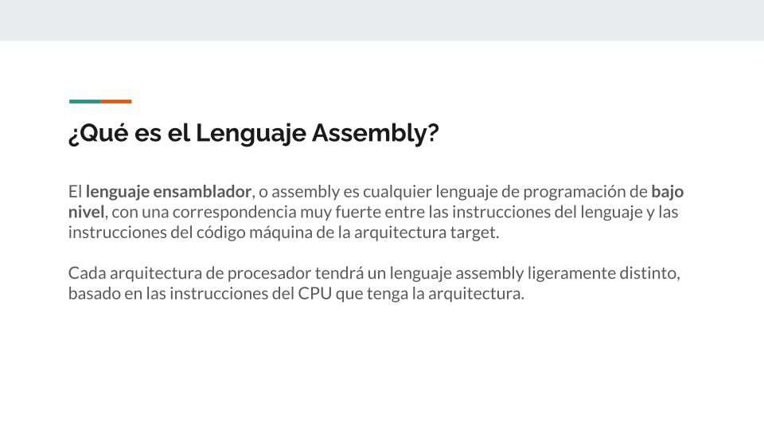
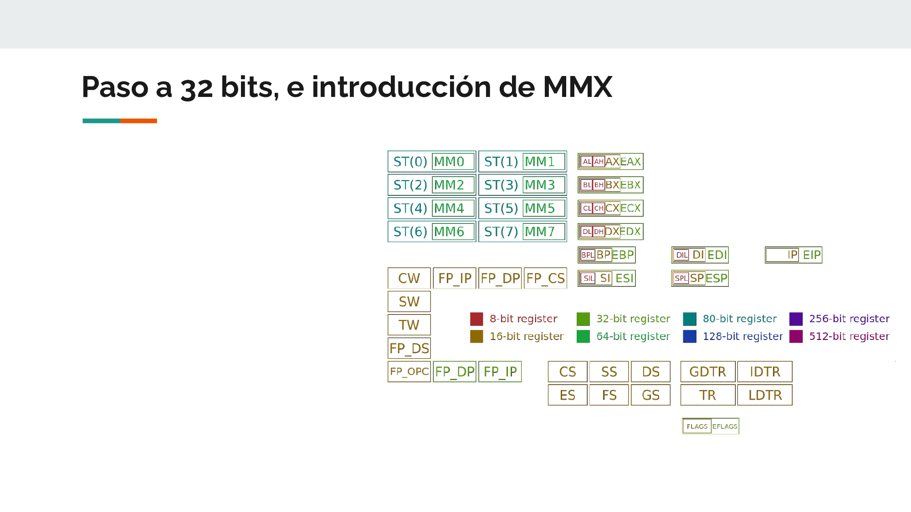
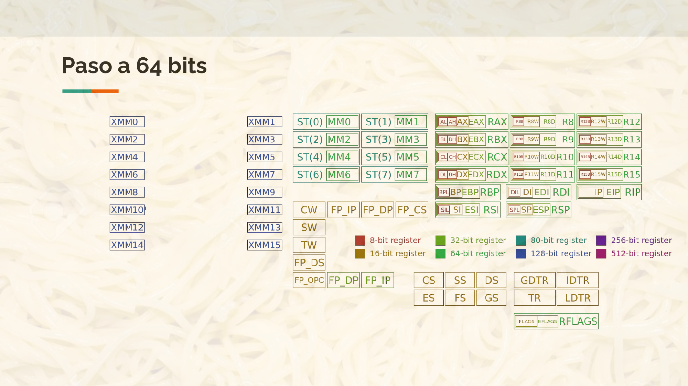
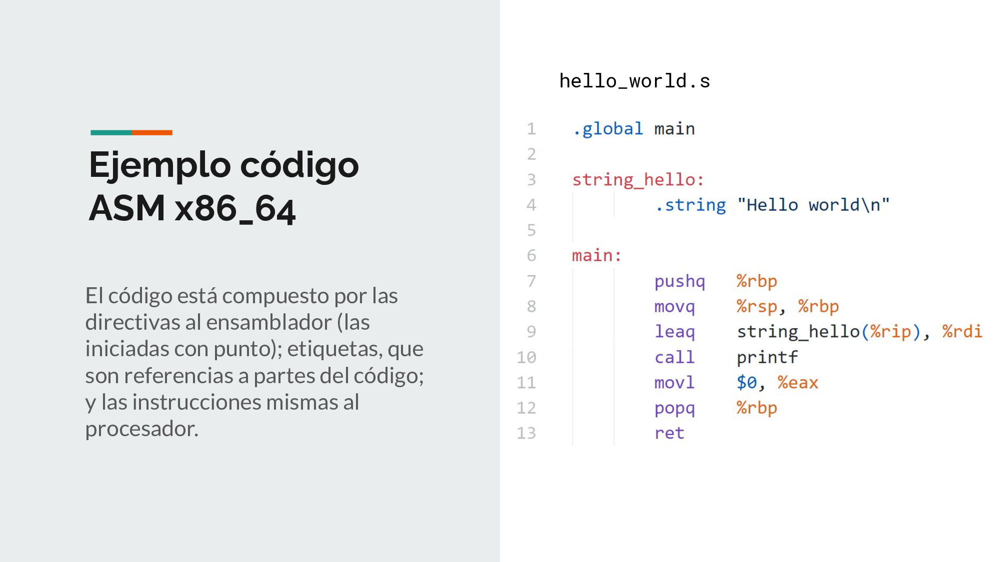
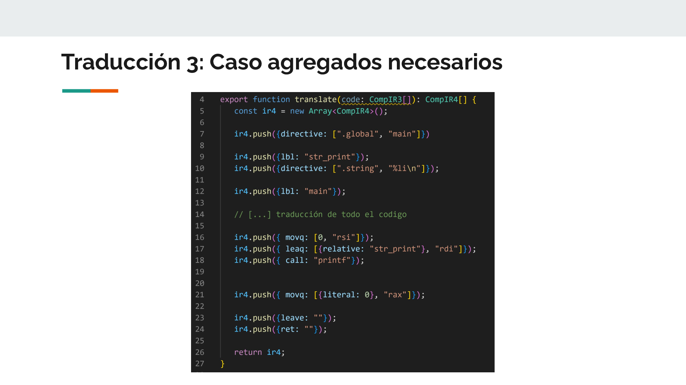
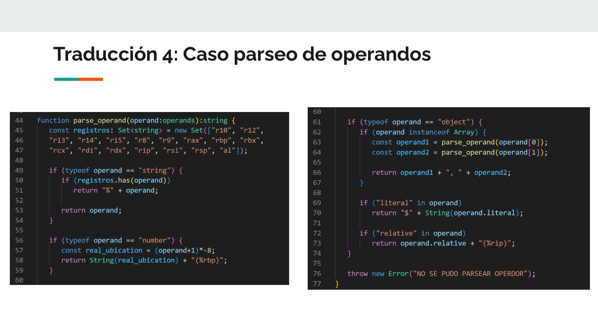

# **Ruta: Tecnologías industriales**   Assembly x86_64

## **Lenguaje Assembly**

Para empezar, que es **Assembly**?

**Assembly** es un lenguaje en el que se escriben instrucciones directamente para el CPU, pero en vez de con unos y ceros como machine code, se usan nombres para cada instrucción y registro, se usan etiquetas, macros, y otros elementos, para que el codigo se pueda leer y entender de manera más facil

Cada tipo de Arquitectura va a tener un lenguaje assembly un poco distinto, porque cada tipo de CPU tiene distintas instrucciones, y tambien puede ser un poco distinta la sintaxis que se usa.

 

---

## **La arquitectura**

Entonces, vemos la arquitectura que voy a usar, que es parte de x86

**x86** es una familia de sets de instrucciones que desarrolló Intel a fines de los años 70. El primer procesador que usó el set de instrucciones fue el 8086 lanzado en 1978. El año siguiente se lanzó el 8088, que usa la misma arquitectura, y fue el procesador que uso la IBM PC original, y por lo tanto, en los clones PC compatibles, que logró convertir a x86 en la arquitectura más popular para computadoras de escritorio.

 

La arquitectura a lo largo de los años evolucionó, agregandose nuevos registros y nuevas instrucciones a medida que avanzaba la tecnología.

Inicialmente tenía unos 8 registros de proposito general, cada uno de 16 bits, y disponía de 117 instrucciones distintas.

Suponiendo que tambien tuvieras el co-procesador de punto flotante, tenías 8 registros más para almacenar los valores y resultados de las nuevas 68 instrucciones.

 

Para mediado de los 90, el set de instrucciones dio el paso a procesadores de 32 bits. Se extendieron los registros de uso general, y además se introdujo una de las primeras extensiones al set de instrucciones, la extension MMX,
Es un conjunto de nuevos registros e instrucciones con la filosofía SIMD, que significa single instruction, multiple data.
Osea que cada uno de los nuevos 8 registros pueden almacenar un entero de 64 bits, o dos enteros de 32, 4 de 16, o 8 de 8 bits, y una sola instruccion podría realizar la operacion de cada uno de los valores de un registro, con cada uno de los valores de otro registro mmx.
A estas alturas, hay alrededor de 210 instrucciones.

 

Al principio de los 2000 Con la introduccion de la extension SSE (y sus proximas generaciones), por fin se agregaban instrucciones modernas para operar con numeros de punto flotantes de hasta doble presicion.
La extension tambien tenia instrucciones similares a las MMX, pero para los nuevos 8 registros de 128 bits.
Ya para la version 4 de SSE, se habían agregado unas 280 instrucciones nuevas, llevando el total a pocas menos que 500 instrucciones.

 

A finales de 2003, amd lanzó el primer procesador de 64 bits.
En esta iteracion, los 8 registros de proposito general son extendidos a 64 bits, y se le agregan 16 registros extras, tambien de proposito general.
Tambien se extiende la cantidad de registros XMM, los agregados por la extension SSE, al doble, teniendo ahora 16 registros para operaciones SIMD, y de punto flotante.

 

Finalmente llegamos a las ultimas evoluciones de la arquitectura x86_64, que es cuando se agrega la extension AVX. La extension agrega 16 nuevos registros XMM, y extiendo todos estos registros a 256, y 512 bits, y extiende las instrucciones de SSE a estos nuevos registros de mayor tamaño
El ultimo manual de intel, se documentan 671 instrucciones distintas, algunas hasta teniendo distintas variantes.

 

Como se ve, la arquitectura termina siendo un espaguetti por todas las cosas que se le fueron agregando encima de otras. Pero aunque eso sea una desventaja, tambien es su mayor ventaja, porque la arquitectura todavía es completamente compatible con el modo de funcionamiento del procesador original 8086.

 

---

## **Assembly x64_64**

Lo primero a saber del lenguaje Assembly x86,

es que hay 2 sintaxis distintas para escribir el programa.
La sintaxis AT&T que proviene de los inicios de C, y de Unix en los años 70, antes de que se usara procesadores intel para sistemax Unix.
A medida que paso el tiempo, los procesadores x86 de intel empezaron a usarse tambien para sistemas Unix, o Unix-like, y por lo tanto las herramientas de desarrollo fueron creadas para ser similares a la sintaxis que se usaba antes de los procesadores Intel.
Por otro lado, intel tenía su propia sintaxis que es la documentada en los manuales, que fue la que principalmente usaron en el desarrollo y herramientas usadas para  DOS y Windows .

La mayor diferencia entre la sintaxis de ambos, es el orden de los operandos, estando en uno al reves del otro, y tambien en como se indica el tamaño de bytes a usar en las operaciones.

 

una vez tenemos elegida la sintaxis, en mí caso at&t, tenemos que saber que el codigo assembly no esta formado solo por instrucciones al procesador, sino que tiene:

Las etiquetas, que son indicaciones de ubicaciones de memoria dentro del programa, osea la indicacion del string hello, y la ubicacion de la primera instrucción del main en la líneas 3 y 6.

Tambien estan las directivas al ensamblador, que son las que empiezan con un punto. En este caso la de la linea 1, que indica que la etiqueta main tiene que poder accederse desde afuera del programa, para poder ejecutarlo al iniciar, y la linea 4, que es usada para almacenar ese string en la ubicacion de memoria indicada por la etiqueta.

y por ultimo, si, las instrucciones que representan las operaciones que va a realizar directamente el procesador a la hora de ejecucion

 

Como ejemplo, decidí usar este código C y su compilación a Assembly 
En la imagen de la izquierda se muestra el codigo C que lo que hace es mostrar los numeros de la secuencia Fibionacci desde el 0 hasta 255, y esto se repite indefinidamente.

Podemos ver como cada linea de C esta convertida a las lineas de Assembly, mostrado su relacion con los codigos de color.

En el codigo assembly, en las lineas 4 y 5, se crea el stack frame de `main`. en la linea 6 se agranda el stack para poder almacenar las variables locales.
en las lineas 8 y 9 se almacenan los valores de `x` e `y`.

También en las lineas marcadas en rojo se muestra los pasos que se realizan para, en la linea 14, llamar a la funcion `printf`.

La parte azul, es unicamente una suma. En el caso de esta compilacion, en la que no hay ninguna optimizacion, este proceso se hace bastante largo.
Pero si activaramos la optimización, se podría ver como GCC reduce las 4 instrucciones para la suma a una unica instruccion con aritmetica de punteros que realiza la suma.

finalmente, en la linea 23 del assembler, se realiza la comparacion entre `x`, y el valor 254, para setear los flags que le permita en la siguiente instruccion, decidir si hacer el salto a `.l2`, o no.
En el caso de que no se haga, se hace el salto al inicio del `while`.

 
 

---
## **Mi implementacion del back-end**

Yo decidí hacer mi back end basandome en el lab 6.

De manera iterativa, empecé desde la traduccion de nivel 0, hasta la traduccion de nivel 4, y fui viendo que instrucciones ya no existian, cuales faltaban, y que modificaciones había que hacer a la traduccion para que funcionara con Assembly x86_64.

Por este proceso, la etapa 0, 1 y 2, terminan teniendo el mismo proposito que tenia en el lab 6.

Ya en la traducción 3, tiene generalmente el mismo proposito, pero tengo que agregar al principio y al final del codigo Assembly las instrucciónes necesarias para poder llamar al main, y para poder printear el resultado de la variable `out`.

La traducción 4 es totalmente distinta, porque decidí que para mi backend no quería eliminar las etiquetas del codigo.

Lo hice así porque me parecio que las etiquetas de Assembler son parte importante de lo que los hace entendible para humanos, y me pareció más importante poder luego analizar el archivo assembly, que simplemente reemplazar unas etiquetas por unos numeros, y volver el codigo mucho más inentendible.

En cambio, la traduccion 4 lo que hace, es convertir la lista de objetos para cada instrucción, a un string ya formateado, para después poder ser escrito directamente en un archivo, y poder ensamblarlo y ejecutarlo.

 

Voy a comentar los cambios que me parecieron más relevantes, respecto a como funcionaba el back end en el lab 6.

En la traducción 0, lo unico relevante es la introducción de la primera nueva instrucción, es el de la instruccion `cmpq`, que es una instrucción de comparacion.  lo que hace, es restar el segundo operador menos el primero, pero sin almacenar el resultado, con el objetivo de setear los flags.
esto lo uso en el while, en la iteracion y en el if. 
En el caso este, pueden ver que hago la comparacion con el 0, y luego hago un jump equal. Esto es porque si ambos valores son iguales, quiero omitir el bloque del while, realizando un salto afuera del bloque.
Tambien podría, en vez de hacer una comparacion con el 0, hacer inteligentemente la comparacion de los 2 valores que hace la expresion, y usar el jump correspondiente a la operacion de la expresion.

 

Para la traducción 1, la que elimina las variables, tuve que agregar las instrucciónes que reservan el espacio en el stack para el programa.
Para crear el stack frame, y hacer la reserva de espacio, se puede usar la instruccion `enter`, que recibe en el primer parametro la cantidad de bytes a reservar.

Lo importante a saber, es que el tope del stack debe estar alineado a 16 bytes en la llamada a las funciones externas, como la llamada al `printf`, por lo que tengo que mantener el stack alineado.

Lo que hago es, en la linea 194, le pido a la clase que calcula el id numerico para cada variable, la cantidad de variables totales que existen en el programa. Como trabajo con numeros de 64 bits; cada variable va a ocupar 8 bytes, por lo que multiplico el valor.

Y antes de agregar la instruccion al inicio del programa, en la linea 195, alineo la cantidad de bytes a reservar, al proximo multiplo de 16.

 

En las llamadas a funcion, decidí seguir el estandar que usan los sistemas Unix-like.
En este estandar, los primeros 6 parametros se pasan a la funcion a traves de registros: `rdi`, `rsi`, `rdx`, `rcx`, `r8` y `r9`.
Y el resto de parametros (si hubiera) se pasan a travez del stack, de manera invertida.
Osea, de manera que la funcion llamada, pueda popear los parametros en el orden correcto.

 

Para traducir las operaciones binarias, decidí hacer una implementacion bastante simple, aunque bastante lenta a la hora de ejecucion.
En esta implementacion, lo que hago, es primero traducir recursivamente la expresion izquierda, y despues traducir la expresion derecha, tambien de manera recursiva.

Cada una de estas traducciones recursivas, van a dejar el valor calculado pusheado en el stack.
Por lo que hago es, en el retorno, primero poner el resultado de las traducciones izquierda y derecha, despues popear el elemento derecho hacia el registro b, popear el elemento izquierdo al registro a, realizar la operacion, y pushear el valor resultado de nuevo al stack (que es como antes obtenía los valores del lado izquierdo y derecho).

Cómo me faltó tiempo, implementé solo 3 operaciones binarias.
Para la entrega final, voy a implementar el resto de las operaciones, y si tengo tiempo, intentar encontrar una manera de traducir la operacion, sin abusar tanto del uso del stack.

 

En la traduccion 3, se traducen las declaraciones de fuciones, pero no resulta demasiado interesante, porque es el mismo proceso que para llamar a la funcion, solo que obteniendo los parametros.

Lo que resulta nuevo, es el inicio del codigo, y el final del codigo que se agrega en este paso.

Primero, en la linea 7 agrego la directiva de que la etiqueta `main`. que agrego en la linea 12, es una etiqueta global, una a la que el linker puede acceder, y por la que se va a iniciar el programa.

En la linea 9 y 10 defino el string que se va a usar para imprimir el valor guardado en la variable `out`.

despues de esto, hago la traduccion del resto del codigo, y al final, pongo los parametros en los registros correspondientes, y llamo a `printf`.

Despues almaceno 0 en el registro a, que es el registro donde se almacena el valor de retorno de una funcion, y para terminar la ejecucion del programa, uso la instrucción `leave`, que devuelve el frame pointer, y stack pointer a la ubicación que tenía antes de la última instrucción `enter`. En este caso, los valores que tenían antes de la ejecución de mí programa.
La última instrucción, es la instrucción `ret`, que es la que vuelve de la llamada a función, en este caso, vuelve de la función `main`, al código de la terminal que ejecutó el programa.

 

Finalmente, en la traduccion 4, en la que se convierte el array de objetos en un string.

Para parsear las instrucciones, verifico si es una directiva al ensamblador, un label, o una instruccion, y formateo correctamente segun corresponda.

Así que decidí mostrar como ejemplo el parseo de los operandos.
Como los registros y nombre de labels son strings, tengo que usar un set de todos los registros para saber si es un registro o el nombre de un label.

En el caso de que sea un numero, se que es el id numerico de una variable.
Como el stack crece para abajo, la primera variable, la variable de id 0, esta realmente ubicada en la posicion -8 del inicio del stack. Por lo que tengo que modificar el id como aparece en la linea 57. Tengo almacenado en el registro `rbp` el frame pointer, osea, el inicio del stack, por lo que uso aritmetica de punteros para indicar la posicion relativa al contenido del registro.

Si el operando es un array, es un par de operandos para las intrucciones que reciben 2, y simplemente parseo cada uno por separado, y despues los uno.

Los literales, son el numero que hay, con un simbolo de pesos adelante, y las etiquetas relativas, son etiquetas que tengo que referenciar con aritmetica de punteros, respecto a la instrucción actual, con el registro `rip`.

 

Y finalmente, con todas las traducciones hechas, lo unico que tengo que hacer es, llamar a la funcion run, con las instrucciones en JsonLang
se compila el codigo, obteniendo el string de assembly.
Ese string lo escribo en un archivo `.s`,
y despues lo ensamblo, ejecuto, y obtengo el resultado printeado por el programa.
